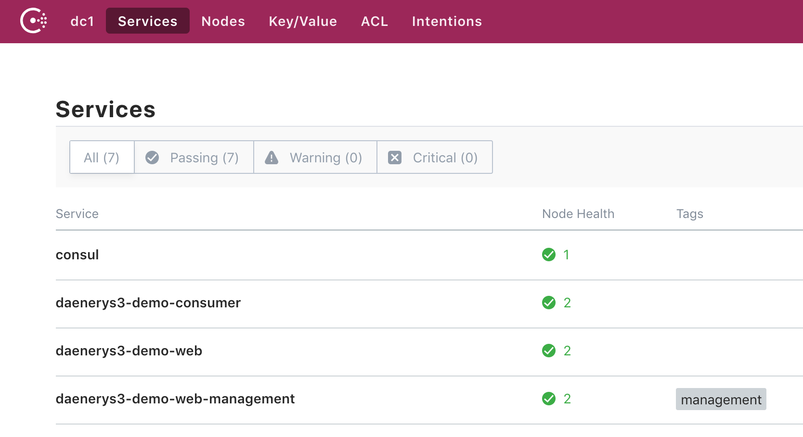

# gfs-demo

---

该项目用于演示基于 gfs 开发的案例

大致描述一下项目的调用关系: 

* gfs-demo-web (以下简称 web) 是一个 web application, 发布了两组 api (EnvController 和 GitController).
* gfs-demo-client (以下简称 client) 是 web 定义的一组调用的 sdk, 便于其它服务去调用自己, 只有两个代码文件: xxxDTO用于描述传输对象, xxxClient 用于定义调用接口.
* gfs-demo-consumer (以下简称 consumer) 通过 web 提供的 client, 调用 web 提供的服务.


项目展示了框架赋予的一些功能:

* [toString 数据脱敏](docs/desensitization.md)
* [基于 consul 的服务发现](docs/consul.md)
* [基于 feignclient 的接口调用](docs/feignclient.md)
* [mybatis 的自动 mapper](docs/mybatis_mapper.md)
* [mybatis 的分页功能](docs/mybatis_pagehelper.md)
* [数据库多数据源](docs/db_multi_datasources.md)
* [redis 多数据源](docs/redis_multi_datasources.md)
* [基于 swagger 的自动api文档生成](docs/swagger.md)
* [统一异常处理](docs/exception_handler.md)
* [统一 metrics](docs/metrics.md)

## Quick Start

项目启动依赖如下组件

1. jdk 1.8
1. maven 3.3.9+
1. consul (默认 http://127.0.0.1:8500)
1. mysql (默认 127.0.0.1:3306 root/root)
1. redis (默认 127.0.0.1:6379)

### 本地环境启动

环境配置信息可在 项目的 application.yml 或 application-dev.yml 中修改

```bash
mvn clean install -U
nohup java -jar gfs-demo-consumer/target/gfs-demo-consumer.jar &
nohup java -jar gfs-demo-web/target/gfs-demo-web.jar & 
```

### docker 启动

```bash
mvn clean package -U
pushd gfs-demo-consumer && mvn docker:build && popd
pushd gfs-demo-web && mvn docker:build && popd
docker-compose up
```

启动完成后, 我们在 consul 后台 ([http://127.0.0.1:8500/ui/dc1/services](http://127.0.0.1:8500/ui/dc1/services)) 看到一共注册了四个服务:

* consul // consul 自注册
* gfs-demo-web // web 应用
* gfs-demo-web-management // web 应用的管理服务, 随 demo 一起启动在不同的端口上.
* gfs-demo-consumer // consumer 应用, 远程调用 web 应用提供的服务



其中 demo(8080) 发布了一组 rest 接口, 如:

* http://127.0.0.1:8080/v1/api/envs
* http://127.0.0.1:8080/v2/api/envs/1

其中 consumer(8081) 则通过 consul 服务发现, 远程调用 web 应用提供的服务, 如:

* http://127.0.0.1:8081/api/envs/1


## TODO

* sonarqube 标准模板
* 支持 jdbc-sharding 分库分表
