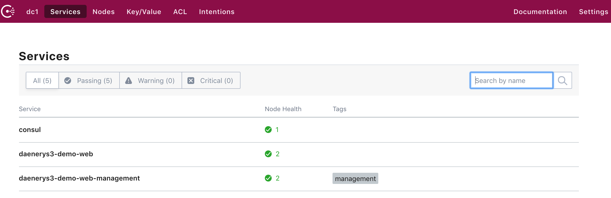

# 基于 consul 的服务发现

---

该项目使用 [Consul](https://www.consul.io/) 用于服务发现

本地开发时可在自己的电脑上启动一个临时的 consul

```sh
docker run -it --rm --name consul -p 8500:8500 consul
```

启动完成后, 可在浏览器中打开 [http://127.0.0.1:8500](http://127.0.0.1:8500)

demo-web 和 demo-consumer 使用 consul 时, 先添加依赖

```xml
<dependency>
    <groupId>com.longfor.gfs</groupId>
    <artifactId>gfs-web-consul</artifactId>
    <version>${gfs.version}</version>
</dependency>
```

在 application.yml 中添加配置

```yaml
spring:
  application:
    name: gfs-demo-consumer
  cloud:
    consul:
      host: 127.0.0.1
      port: 8500
      discovery:
        register: true
        serverName: gfs-web-consumer
        healthCheckInterval: 5s
        instanceId: ${spring.application.name}:${vcap.application.instance_id:${spring.application.instance_id:${random.value}}}
```

启动完成后, 应该就能在 consul 后台看到自己的应用


