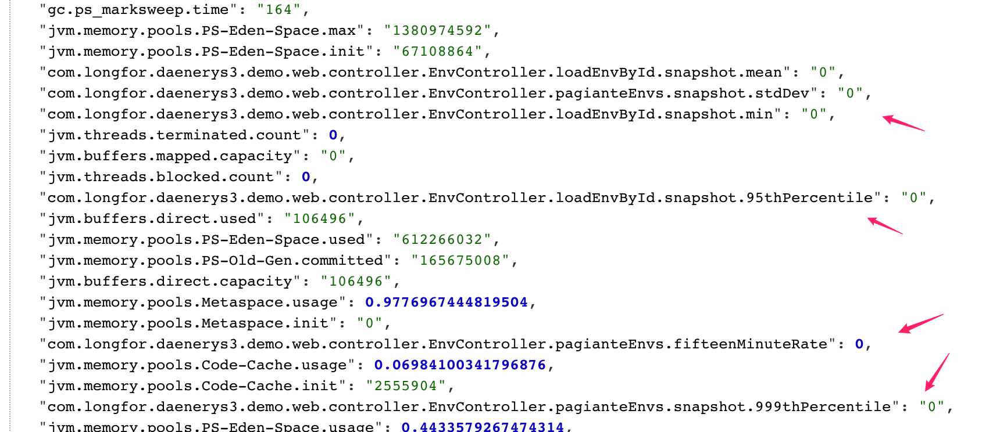

# 统一 matrics

---

支持添加请求 metrics, 当前支持如下 metrics:

- spring-boot actuator
- jmx
- dropwizard 
- prometheus

## 用法

maven pom.xml 中添加依赖

```xml
<dependency>
    <teamId>com.longfor.daenerys3</teamId>
    <artifactId>daenerys3-web-metrics</artifactId>
    <version>${daenerys3.metrics.version}</version>
</dependency>
```

如此, 就打开了 spring-boot actuator 的 metrics [http://127.0.0.1:8080/metrics](http://127.0.0.1:8080/metrics])

这里注意一点, 如果在 application.yml 中配置了 `management.port`, metrics 将使用这个 port.

### Dropwizard

[Dropwizard metrics](https://metrics.dropwizard.io/) 提供了一组非常便利的 metrics 工具, 详细的应用可以参考官方文档.

举例来说:

我们在 controller 上 添加 @Timed


则会在上述的 metrics 接口中出现相应的时间统计.



### JMX

application.yml 中添加 

```yaml
longfor:
  web:
    metrics:
      jmx:
        enabled: true # default true
```

### Prometheus

application.yml 中添加 
```yaml
longfor:
  web:
    metrics:
      prometheus:
        enabled: true # default false
```

使用 [http://127.0.0.1:8080/prometheus](http://127.0.0.1:8080/prometheus) 进行访问

使用 prometheus metrics, 会将上述的 dropwizard 和 jmx 信息一起监控起来


