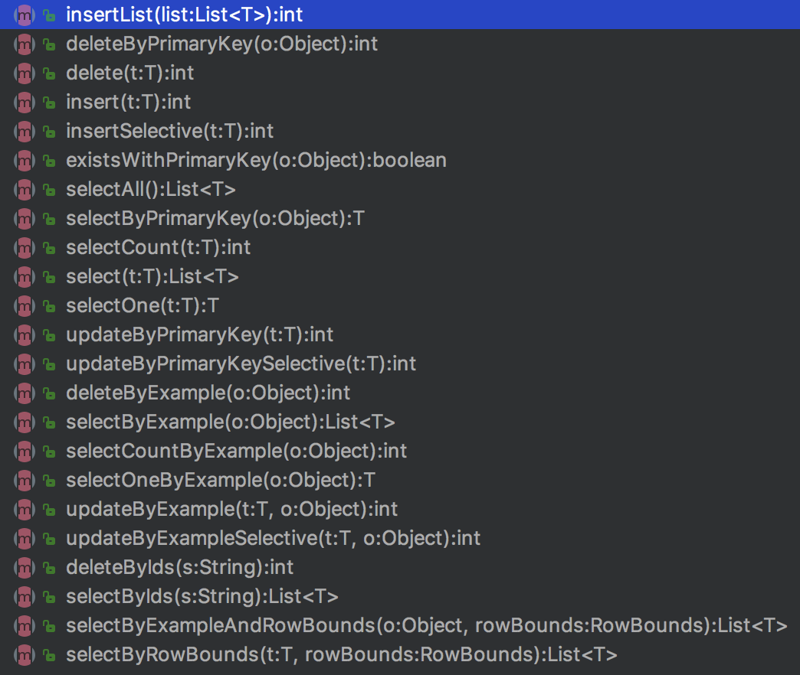

# mybatis 的自动 mapper

---

## 用法

maven 添加依赖

```xml
<dependency>
    <groupId>com.longfor.gaia.gfs</groupId>
    <artifactId>gfs-data-mybatis</artifactId>
    <version>${gfs.version}</version>
</dependency>
```

### mybatis 的自动 mapper

使用 [Mybatis通用Mapper](https://github.com/abel533/Mapper/wiki) 实现.

更多是的使用方式参考官方文档.

样例参考 `EnvMapper.java`, 里面通过接口已经实现了部分功能, 另外还有自定义的 sql.



LFMySQLMapper 已经为你完成了 90% 的 sql, 仅需自定义一些特殊的 sql 即可.

application.yml 配置中添加

```
mybatis:
  typeAliasesPackage: com.longfor.gaia.gfs.demo.web.repo.dao.entity
  mapperLocations:
  - classpath:mapper/*.xml

mapper:
  notEmpty: true
```

添加一个 DalConfig 类. 其中最重要的一点是 @Mapper 用的是 `tk.mybatis.spring.annotation.MapperScan`.


