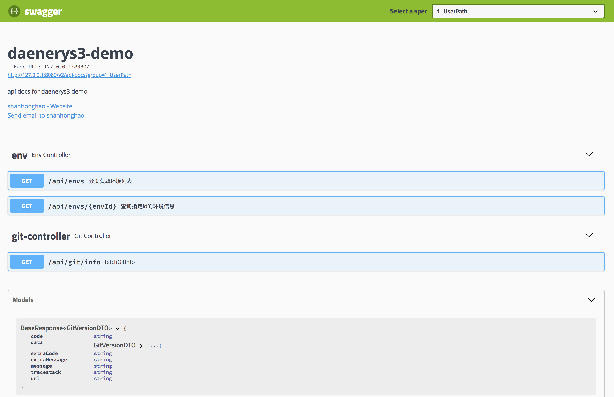

# 基于 swagger 的自动api文档生成

---

# [Swagger UI](https://swagger.io/tools/swagger-ui/)



swagger 允许用户直接在代码层面去维护 api 文档.
带来的最直接的好处是, 避免了由于代码和文档分离, 导致常常出现文档和实际代码不一致, 从而维护异常困难的问题.

对于开发同学, 
正是由于 swagger 是通过 annotation 直接作用在代码上的, 所以一定程度上可以代替 javadoc.

对于 QA 同学,
swagger ui 直接在页面上提供了简单的调用工具, 可以快速验证 api.

## 用法

maven pom.xml 中添加依赖

```xml
<dependency>
    <groupId>com.longfor.daenerys3</groupId>
    <artifactId>daenerys3-web-swagger</artifactId>
    <version>${daenerys3.version}</version>
</dependency>
```

application.yml 中你的项目进行描述.

```yaml
longfor:
  web:
    swagger:
      enabled: true
      description: api docs for daenerys3 demo
      basePackage: com.longfor # swagger 将自动扫描该 package下面的的所有 @RequestMapping, default "com.longfor"
      contact:
        name: shanhonghao
        url: https://www.shanhh.com
        email: i@shanhh.com
```

针对你的 dto:  

* 在 class 上使用 @ApiModel
* 在 field 上使用 @ApiModelProperty

```java
@ApiModel("env 信息")
@Data
@NoArgsConstructor
public class EnvDTO {

    @ApiModelProperty(value = "自增id", example = "1")
    private Integer id;
    @ApiModelProperty(value = "环境名称", example = "dev")
    private String name;
    @ApiModelProperty(value = "环境描述", example = "研发环境")
    private String description;
    @ApiModelProperty(value = "创建者", example = "shanhonghao")
    private String createBy;
    @ApiModelProperty(value = "修改者", example = "shanhonghao")
    private String updateBy;
    @ApiModelProperty(value = "创建时间", example = "2018-01-01T01:00:00")
    private Date createTime;
    @ApiModelProperty(value = "修改时间", example = "2018-01-01T01:00:00")
    private Date updateTime;
}
```

针对你的 controller

在 class 上使用 @Api
在 method 上使用 @ApiOperation
在 param 上使用 @ApiParam
```java
@Api(value = "env 相关API", tags = {"env"})
@RestController
@RequestMapping("api/envs")
public class EnvController {

    @Resource
    private EnvService envService;

    @ApiOperation(value = "分页获取环境列表", notes = "curl -X GET \"http://127.0.0.1:8080/api/envs?pageNum=0&pageSize=10\" -H \"accept: application/json;charset=UTF-8\"")
    @GetMapping(value = "", produces = MediaType.APPLICATION_JSON_UTF8_VALUE)
    public BaseResponse<PageInfo<EnvDTO>> pagianteEnvs(
            @ApiParam(value = "当前页码", required = false)
            @Valid @Min(0)
            @RequestParam(value = "pageNum", required = false, defaultValue = "0") Integer pageNum,

            @ApiParam(value = "分页大小", required = false)
            @Valid @Min(1)
            @RequestParam(value = "pageSize", required = false, defaultValue = "10") Integer pageSize,

            @ApiParam(value = "环境名称", required = false)
            @RequestParam(value = "name", required = false) String name
    ) {
        return new BaseResponse(envService.paginateEnvs(pageNum, pageSize, name));
    }
}
```
注意上面的 @ApiOperation 的 notes 里写的 `curl -X` 什么的只是描述, 随便写什么都可以

非常方便的一点是, 即使你什么都不写, swagger 会自动发现所有的接口并文档化.
除非你手动在 controller 的 method 上用 @ApiIgnore 标记